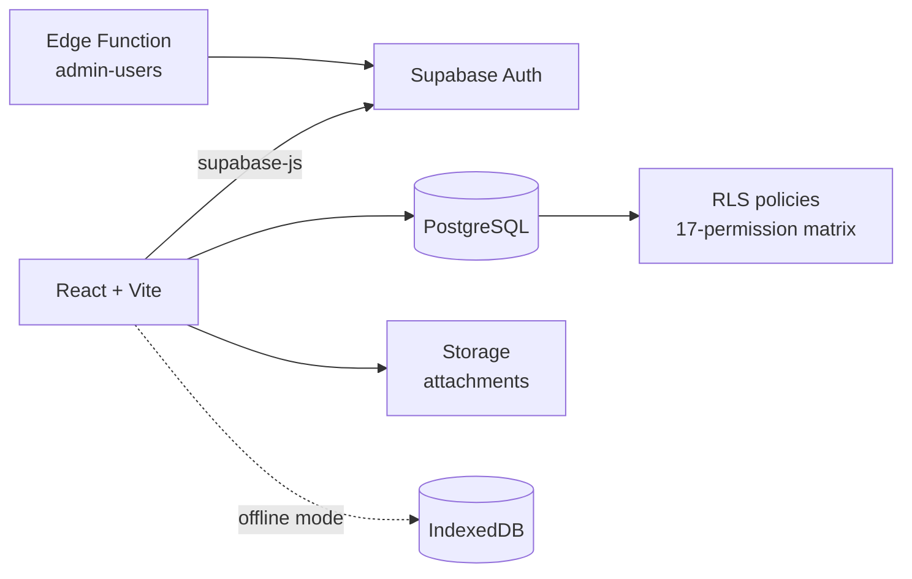

<div align="center">

# 🏗️ Site Issues Tracker
### Construction site follow-up system — replacing Word files passed around on WhatsApp


</div>

---

## 📌 Overview

On a large subcontract, site requirements and open issues were tracked in a Word document that was re-sent on WhatsApp after every update — nobody knew which copy was current. This system turns that list into a **live web app**: every item, its execution steps, owner, priority, status and history in one place, visible to the whole team in real time.

## ✨ Features

- 📋 **Items with execution steps** — each item broken into 4 tracked steps with automatic progress %
- 🏷️ **Categories, priorities & side notes** — filter, search, table or card view
- 🚨 **"Needs attention" view** — overdue, blocked and unassigned items surfaced automatically
- 👤 **4 roles × 17 permissions** (admin / manager / user / viewer) enforced by **RLS in PostgreSQL**, not by hiding buttons
- 🕵️ **Activity log** — who logged in, when, and every change they made
- 📎 **Attachments** via Supabase Storage
- 🖨️ **Printable reports** with a clickable table of contents; each section starts on a new page (PDF-ready)
- 🌍 **Arabic RTL / English LTR** with instant switching
- 📶 **Two modes** — online (Supabase) or offline/local (IndexedDB)

## 🏗️ Architecture



User accounts are created through a server-side **Edge Function** so the `service_role` key never reaches the browser.

## 🚀 Getting Started

1. Create a Supabase project and run the SQL files in `supabase-backend/` in order (`01_schema` → `02_rls` → `04_storage` → `06_activity_log`).
2. Deploy the `supabase/functions/admin-users` Edge Function.
3. Run the app:

```bash
npm install
cp .env.example .env     # VITE_SUPABASE_URL + VITE_SUPABASE_ANON_KEY
npm run dev
```

Detailed Arabic guides: **[docs/SETUP_AR.md](docs/SETUP_AR.md)** · **[supabase-backend/دليل التشغيل.md](supabase-backend/)**

> This public version ships **without any project data** — the database starts empty.

---

## 👤 Author

**Mahmoud Shahab** — AI Department Manager · AI Automation & Operations
Building AI-powered systems that turn messy operations into clear, trackable workflows.

[](https://www.linkedin.com/in/mahmoud-shahab-ai)
[](https://github.com/ShekoDev)

© Mahmoud Shahab — All rights reserved.
